<p align="center"><a href="README.md">🇧🇷 Português</a> · <b>🇺🇸 English</b></p>

<p align="center">
  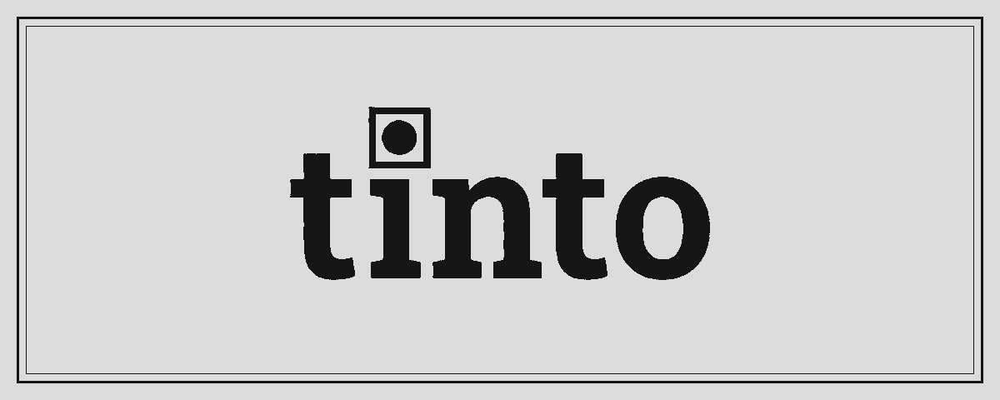
</p>

<p align="center">
  <b>A hybrid pocket-and-desk planner with an e-ink/e-paper screen.</b><br>
  Hold a button, speak, and what you said becomes an event or a task in your Google Calendar, or a note on the Tinto.
</p>

<p align="center">
  <a href="https://github.com/Bernardik226/Tinto/actions/workflows/testes.yml"></a>
  <a href="https://github.com/Bernardik226/Tinto/actions/workflows/firmware.yml"></a>
  <a href="LICENSE"></a>
  
  
  
  
</p>

<p align="center">
  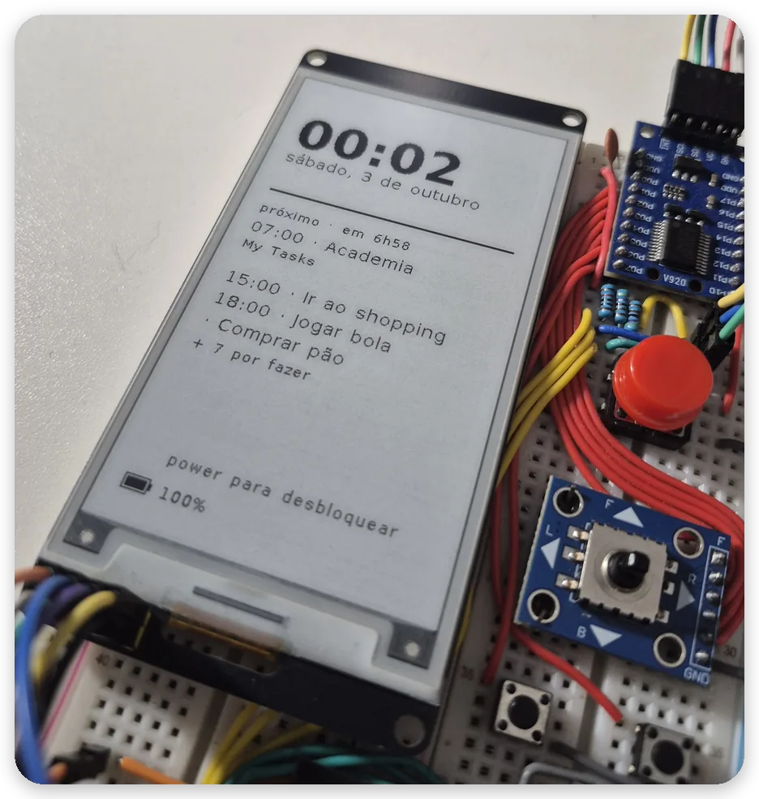
</p>

---

I wanted to write things down without opening my phone, because every time I
opened it to note one thing, I ran into dozens of other distractions. That's
what the Tinto is: a pocket-and-desk planner with an e-ink screen.

> **Status:** version 1.0, in daily use, built on a breadboard and powered
> over USB. Case, battery and a custom board come in v2.
>
> **Language:** the device UI, the firmware and the other docs are in
> Brazilian Portuguese. This README is the English entry point.

<p align="center">
  <a href="https://bernardik226.github.io/Tinto/"></a>
</p>
<p align="center"><b>The real firmware compiled to WebAssembly · or run <code>make janela</code> on your PC</b></p>

## What it does

### 🗓️ Calendar

Yesterday, today and tomorrow, with your Google Calendar events and Google
Tasks to-dos. A month view with the busy days marked, and any day can be
opened. Check off a task on the Tinto and it shows as done on your phone.

<p align="center">
  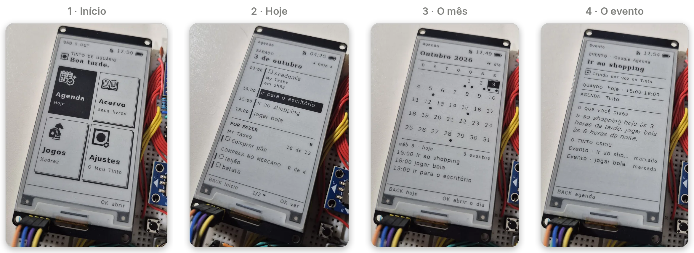
</p>

### 🎙️ Voice

Hold the button and speak; you can pause and resume. An AI splits what you
said into actions: something with a time becomes an **event**, something to
do becomes a **task**, an enumeration becomes a **list** and a thought becomes
a **note**. One recording can produce up to 3 actions.

<p align="center">
  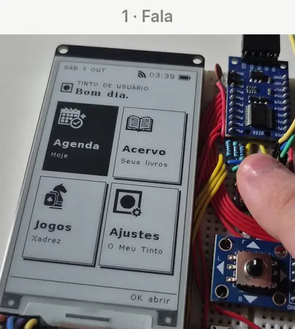
  &nbsp;&nbsp;&nbsp;
  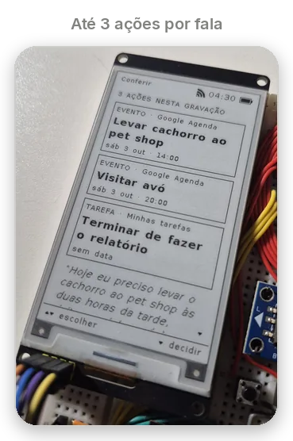
</p>
<p align="center"><sub>Real time: the speech, the wait for the AI, the event landing in Google Calendar and back on the Tinto.</sub></p>

### 📚 Library

Texts and books (PDF, EPUB, TXT) sent from your phone are downloaded to the
card and read on the e-ink screen, with your choice of font and size. The
device remembers where you stopped.

<p align="center">
  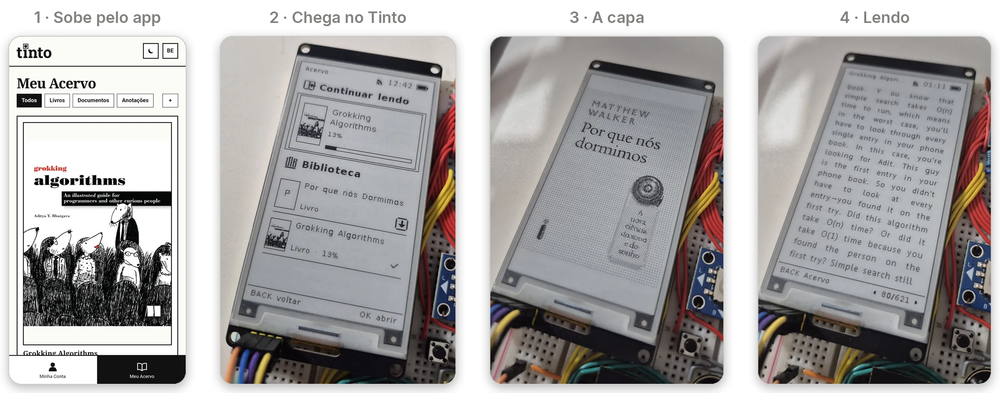
</p>
<p align="center"><sub>The cover on the device is drawn in 1 bit, with dithering.</sub></p>

### ♟️ Chess

For the breaks: against the computer, at three levels, or two players on the
same device, passing it from hand to hand.

Chess is the first game; others will come over time.

<p align="center">
  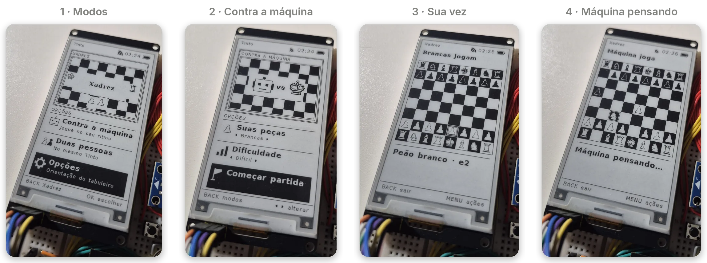
</p>

### ⚙️ Settings

Your Google account, voice usage, visible calendars, Wi-Fi, time and screen,
and card storage, all on the device itself.

<p align="center">
  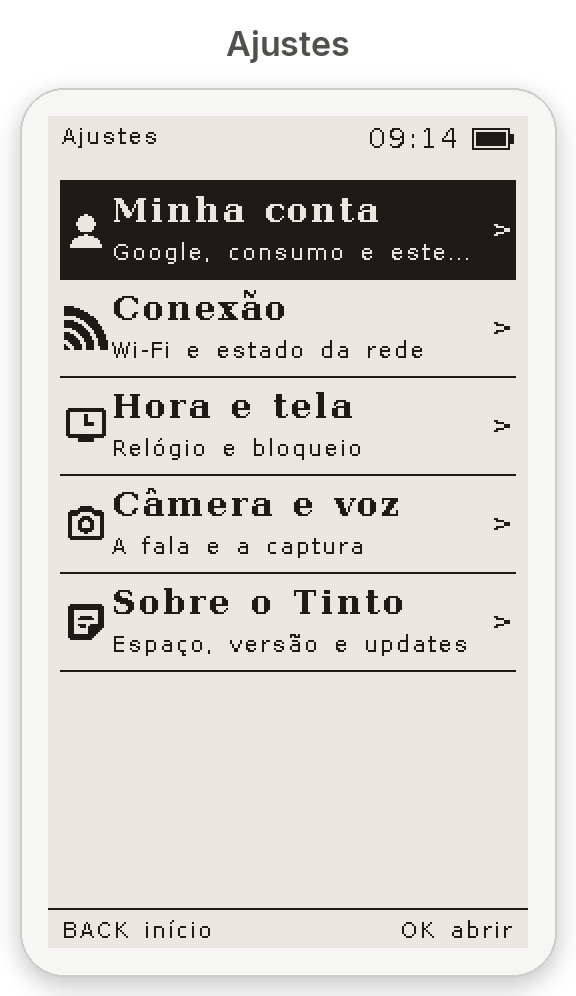
  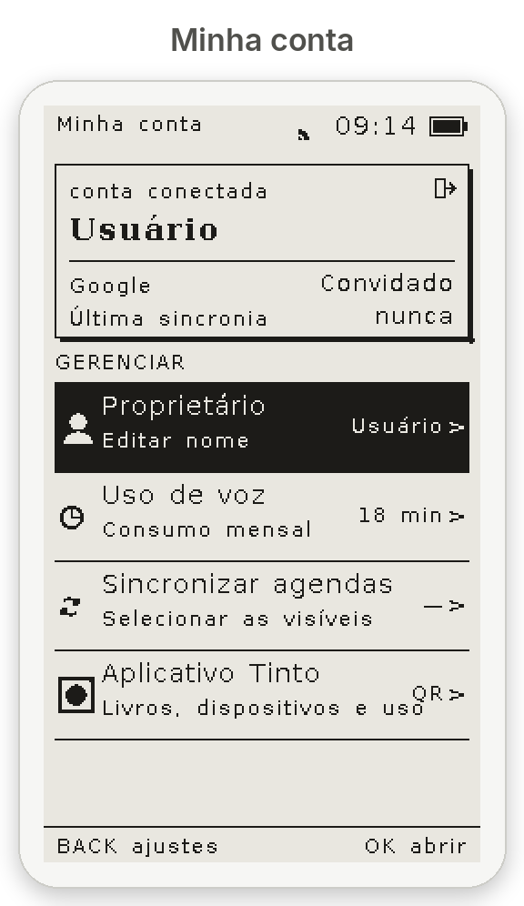
  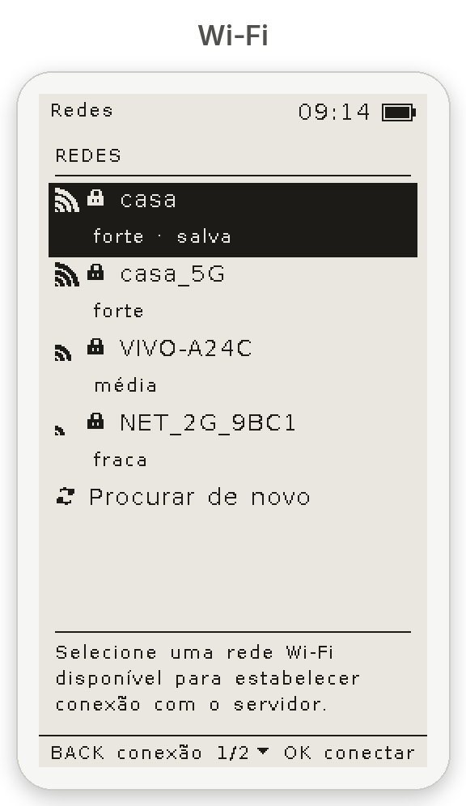
  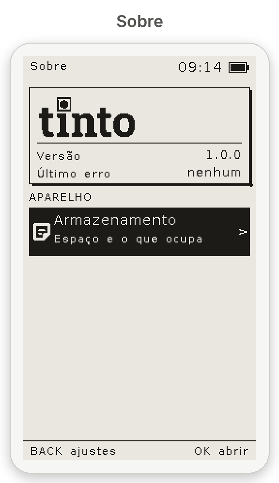
</p>
<p align="center"><sub>The “Câmera e voz” (camera and voice) item already reserves a spot for the camera, coming in v2.</sub></p>

###  Phone app

A PWA you install on your phone. With it you link your Google account, name
your Tintos, follow your monthly voice usage, read your notes and send texts
to the library.

<p align="center">
  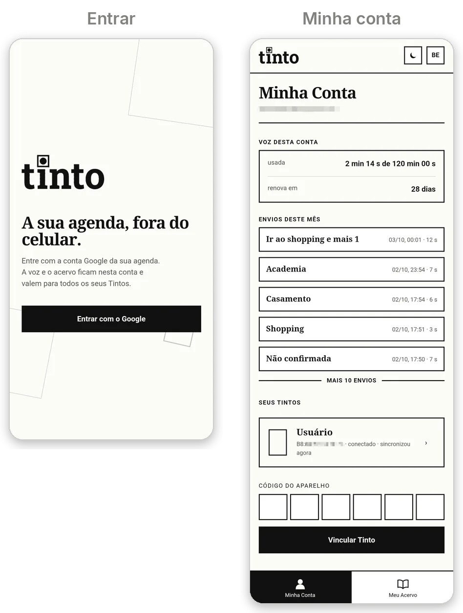
</p>

### 📶 Offline

The Tinto keeps showing the day, your events, your tasks, the downloaded
library and chess. Speaking and changing data need the network, and when it's
missing, the screen says so right away.

<details>
<summary><h3>The status bar icons</h3></summary>

<p align="center">
  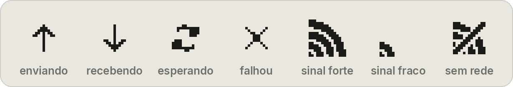
</p>

On the right side of the bar, the order is always sync, Wi-Fi, time and
battery. The first two come and go; the time and the battery never move.

- **Up arrow:** something going to the server, or an action waiting for the
  network to come back.
- **Down arrow:** what changed in Google arriving on the device.
- **Circular arrows:** some other wait in progress, like scanning for networks
  or setting the clock.
- **X:** the last exchange with the server failed. It goes away on its own
  when the next one succeeds.
- **No sync icon:** everything is up to date.
- **Wi-Fi:** three signal levels. Without a network it leaves the bar and the
  bottom of the screen says "SEM REDE" (no network).

</details>

## What makes it different

### 🔁 A planner, not a recorder

Other e-ink voice devices record and transcribe. The Tinto reads and writes
your Google Calendar and Tasks, both ways: what you mark on the device shows
up on your phone, and what changes on your phone shows up on the device.

### ✅ The AI proposes, you confirm

The review screen shows every action the AI understood, with its destination
and your original sentence below. Nothing reaches your calendar without your
OK, and rejecting deletes the recording too.

### ⏸️ You control the recording

The button pauses and resumes, and the pieces go into the same file on the
card. You can think calmly without paying to transcribe silence or sending
noise for the AI to get wrong. After you confirm or discard, the audio is
deleted.

## How it works

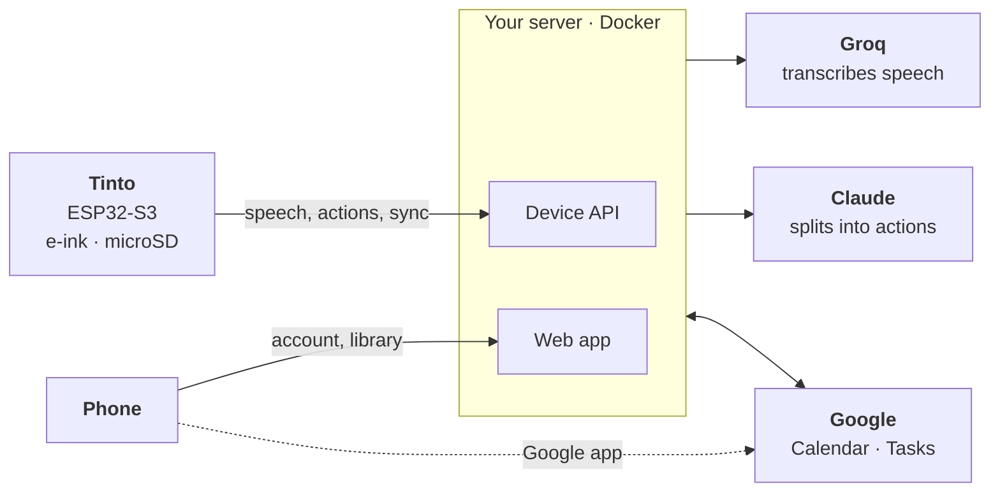

The Tinto only talks to **your server**. The server talks to Google and to
the AIs, and your phone keeps using the calendar app you already have.

<details>
<summary><h3>Why it was built this way</h3></summary>

- **A server in the middle:** Google doesn't let browserless devices access
  Calendar and Tasks, and an AI key in the firmware leaks in a flash dump.
- **Google as the front door:** Google sign-in authenticates whoever uses the
  app and links each Tinto to an account, and only the emails in
  `TINTO_CONTAS` get in. The project doesn't reinvent passwords, account
  recovery and sessions, and your AI keys stay behind the people you allowed.
- **E-ink:** it holds the image without power and doesn't glow. That's why
  the UC8253 controller driver is custom, with partial refresh by band.
- **Audio on the card:** at 32 KB/s, PSRAM fills up in minutes. On the card,
  you can pause and resume for as long as you need.
- **Two cores:** networking and HTTPS crypto are pinned to core 1 of the
  ESP32-S3, at a lower priority than the screen, audio and buttons. A slow
  connection never freezes the device; with both on the same core, the
  screen lagged about 700 ms per step.
- **Firmware on the PC:** the hardware sits behind a struct (`hal_t`), and a
  simulator runs the whole device. The tests press buttons and check the
  screens without a board.

</details>

## Privacy

- 🏠 **The server is yours.** There is no Tinto cloud.
- 🗑️ **The audio doesn't stay.** Transcribed, confirmed, discarded.
- 📝 **Notes are yours alone.** They never go to Google.
- 🔑 **No keys on the device.** They all live on your server.
- 🤖 **What leaves:** your speech goes to Groq for transcription, and the
  text, with the titles of your upcoming events, goes to Anthropic.

## What it costs

Around **R$ 130–170** in parts (roughly US$ 25–30, October 2026, without
shipping or taxes; prices from the Brazilian market).

| Part | Model | Price |
|---|---|---|
| Board | Freenove ESP32-S3-WROOM CAM (N16R8) | R$ 35–40 |
| Screen | 3.7" e-ink 240×416, WeAct GDEY037T03 | R$ 60–70 |
| Microphone | INMP441 | R$ 10–20 |
| Expander | PCF8575 | R$ 15–30 |
| Joystick | 5-way | R$ 8 |
| Buttons | voice, power, MENU, BACK | a few reais |
| Storage | microSD | whatever you have |

<details>
<summary><h3>Can I use another board?</h3></summary>

Yes, any ESP32-S3 with PSRAM, adjusting the pins in
[`firmware/main/pins.h`](firmware/main/pins.h). The Freenove was chosen for
the v2 camera and for its microSD slot on a dedicated bus (SD-MMC), which
never competes with the screen for SPI. An SPI microSD module costs about
R$ 10, but today the firmware only speaks SD-MMC: SPI requires adapting
`firmware/main/hal/hal_sd.c`. There's no official case yet: build it however
it fits. Full pinout in [HARDWARE](docs/HARDWARE.md) (Portuguese).

</details>

## Build your own

There's no central service: everyone runs their own server.

1. 🐳 **Server:** a Docker container, with a Google Cloud project and Groq
   and Anthropic keys. The `TINTO_CONTAS` list decides who gets in.
2. 🔧 **Firmware:** ESP-IDF 5.3, with your server address in
   `firmware/main/servidor.h`.
3. 📲 **First use:** name, Wi-Fi and a QR code that opens the app on your
   phone. You sign in with Google and type the code shown on the Tinto.

<p align="center">
  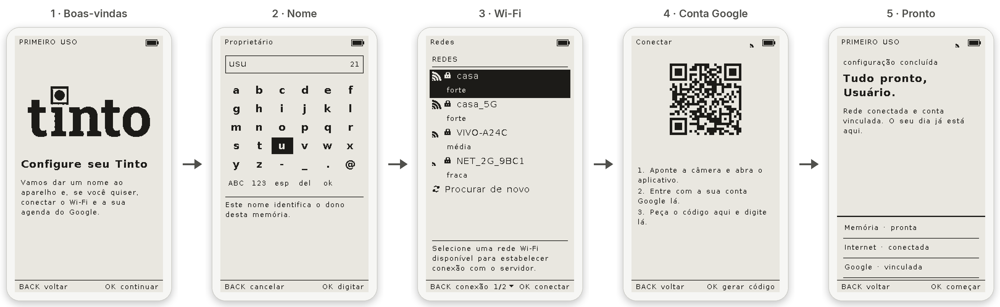
</p>
<p align="center"><sub>The QR code opens the app on your phone. There you sign in with Google and type the 6-digit code the Tinto shows. One account can have as many Tintos as it wants.</sub></p>

Step by step in **[docs/MONTAR.md](docs/MONTAR.md)** (Portuguese). Building
it with an AI agent? Ask it to read [docs/AGENTES.md](docs/AGENTES.md) first;
it can follow the guide in any language.

<p align="center">
  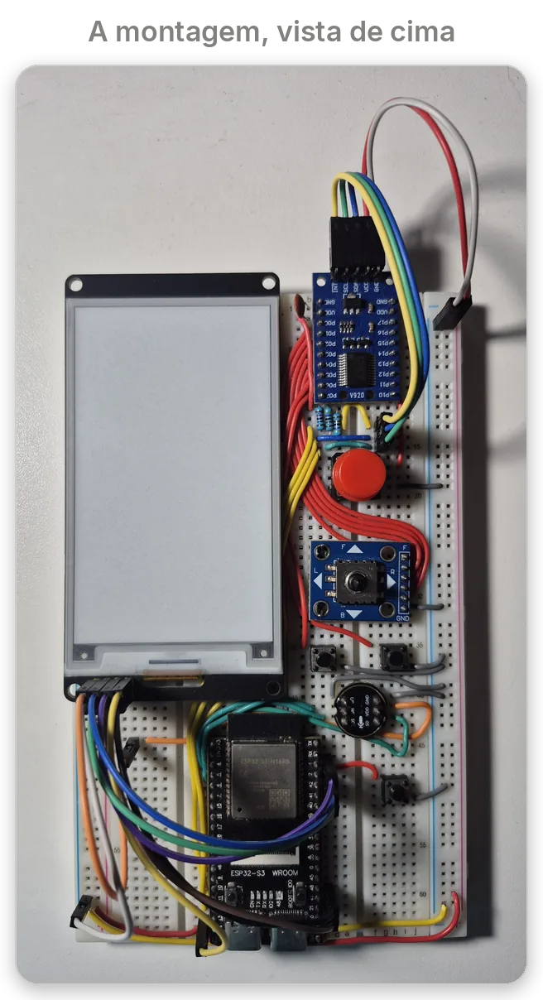
</p>

<details>
<summary><h3>Pinout</h3></summary>

The single source is [`firmware/main/pins.h`](firmware/main/pins.h); if your
board is different, that's where you adjust it.

| ESP32-S3 | GPIO |
|---|---|
| E-ink SCK · MOSI | 41 · 42 |
| E-ink CS · DC · RST · BUSY | 1 · 21 · 14 · 47 |
| microSD CMD · CLK · D0 (board slot) | 38 · 39 · 40 |
| INMP441 SCK · WS · SD (`L/R` to GND) | 5 · 6 · 4 |
| Power button | 2 |
| I2C SDA · SCL (PCF8575) | 12 · 13 |
| PCF8575 INT (10 kΩ pull-up) | 9 |

| PCF8575 (address `0x20`) | Port |
|---|---|
| Joystick up · down · left · right · OK | P00 · P01 · P02 · P03 · P04 |
| MENU · BACK | P05 · P06 |
| Voice | P10 |

Avoid GPIO 26–37 (flash and PSRAM), 19 and 20 (USB), 43 and 44 (log) and
0, 3, 45 and 46 (boot). Details in [HARDWARE](docs/HARDWARE.md).

</details>

<details>
<summary><h3>Schematic</h3></summary>

<p align="center">
  <a href="docs/telas/esquematico.svg">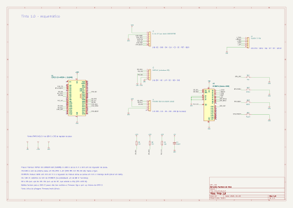</a>
</p>

The file opens in KiCad: [`hardware/tinto.kicad_sch`](hardware/tinto.kicad_sch).
Click the image to see it full size.

</details>

<details>
<summary><h3>Development</h3></summary>

```bash
make test       # the firmware test suite, on the PC
make backend    # the server test suite, against a fake Google
make janela     # the device in your browser, at localhost:8080
make web        # the Pages demo in build/web (needs zig)
make provas     # every screen as a PNG, at real scale
make firmware   # build for the board
```

The docs below are in Portuguese.

| Document | |
|---|---|
| [MONTAR](docs/MONTAR.md) | server, firmware and first use |
| [AGENTES](docs/AGENTES.md) | the short map for an AI agent to guide the build |
| [HARDWARE](docs/HARDWARE.md) | parts, pinout, memory and power |
| [CAMADAS](docs/CAMADAS.md) | the firmware architecture and the simulator |
| [UI](docs/UI.md) | the screen layer |
| [EINK](docs/EINK.md) | the panel driver and refresh |
| [SISTEMA](docs/SISTEMA.md) | data, Google, server, AI and card |
| [ENGENHARIA](docs/ENGENHARIA.md) | tasks, errors, memory, build and CI |
| [REGRAS](docs/REGRAS.md) | the behavior rules, cited by the tests |

</details>

<details>
<summary><h3>Known limitations</h3></summary>

- 2.4 GHz Wi-Fi only, like every ESP32.
- USB power only: the battery is for v2.
- Recordings have no length cap on the device. The real limit is the monthly
  voice quota and the file size Groq accepts.
- Single-process server, with its state in a JSON file: good for one
  household.
- The Google token is stored unencrypted on the server volume: protect it and
  back it up.
- Built on a breadboard, still without a case or custom board.

</details>

## What's next

- 📷 **Camera**, with dithering for the e-ink screen, and photos annotated by
  voice as a record of the day.
- 🧾 **Thermal printer**, to print those photos as a keepsake of a moment.
  Each printed photo carries a QR code that opens the original for whoever
  holds the paper, and the link works until you remove the photo from your
  gallery.
- 🔋 **Battery** and a **magnetic dock** for charging.
- 🖼️ **Illustrated books.**
- 📡 **Over-the-air updates (OTA).**
- 📦 **3D-printed case and custom board.**

## License

[GPL-3.0](LICENSE) · Copyright (C) 2026 Bernardo Melo. Use, study, modify
and redistribute; modified versions stay under the same license.

<sub>E-ink driver written from scratch, using Jean-Marc Zingg's
[GxEPD2](https://github.com/ZinggJM/GxEPD2) as a reference. Fonts Literata,
Source Serif 4, PT Sans, Atkinson Hyperlegible, Inter, DejaVu and GNU
FreeFont; icons [Phosphor](https://phosphoricons.com). Each keeps its own
license, in `firmware/assets/`. Book covers shown in the images belong to
their publishers and appear only to demonstrate how it works.</sub>
