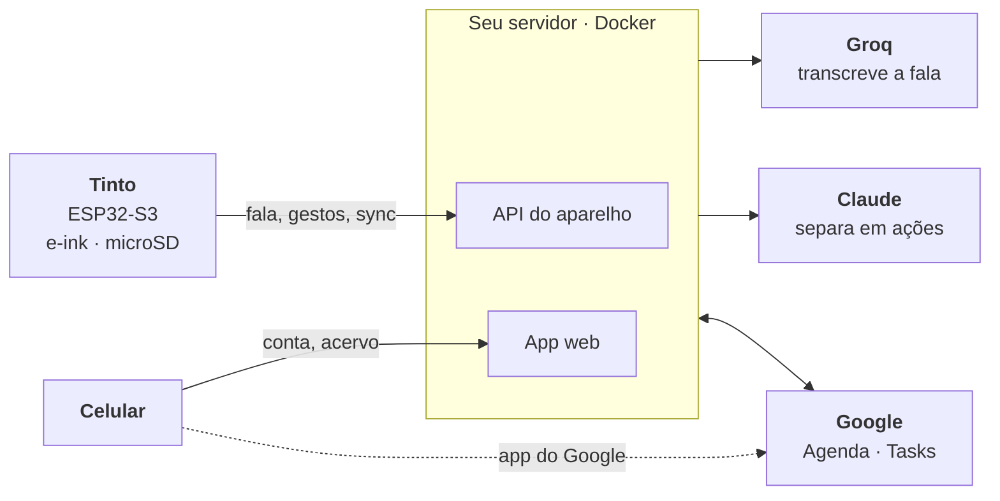

<p align="center">
  
</p>

<p align="center">
  <b>Planner híbrido, de bolso e de mesa, com tela e-ink/e-paper.</b><br>
  Segure um botão, fale, e o que você disse vira evento ou tarefa no seu Google Agenda, ou anotação no Tinto.
</p>

<p align="center">
  <a href="https://github.com/Bernardik226/Tinto/actions/workflows/testes.yml"></a>
  <a href="https://github.com/Bernardik226/Tinto/actions/workflows/firmware.yml"></a>
  <a href="LICENSE"></a>
  
  
  
  
</p>

<p align="center">
  
</p>

---

Eu queria anotar as coisas sem abrir o celular, porque toda vez que eu abria
para anotar uma coisa, dava de cara com dezenas de outras distrações. O Tinto
é isso: uma agenda de bolso e de mesa, com tela e-ink.

> **Estado:** versão 1.0, funcionando no dia a dia, montada em protoboard e
> ligada no USB. Case, bateria e placa própria vêm na v2.

<p align="center">
  <a href="https://bernardik226.github.io/Tinto/"></a>
</p>
<p align="center"><b>O firmware de verdade em WebAssembly · ou rode <code>make janela</code> no seu PC</b></p>

## O que ele faz

### 🗓️ Agenda

Ontem, hoje e amanhã, com os eventos do Google Agenda e as tarefas do Google
Tasks. Um calendário do mês com os dias marcados, e qualquer dia pode ser
aberto. Marcou uma tarefa como feita no Tinto, ela aparece feita no celular.

<p align="center">
  
</p>

### 🎙️ Voz

Segure o botão e fale; dá para pausar e retomar. Uma IA separa a fala em
ações: com hora vira **evento**, coisa a fazer vira **tarefa**, enumeração
vira **lista** e pensamento vira **anotação**. Uma fala pode gerar até 3 ações.

<p align="center">
  
  &nbsp;&nbsp;&nbsp;
  
</p>
<p align="center"><sub>Em tempo real: a fala, a espera da IA, o evento chegando no Google Agenda e de volta no Tinto.</sub></p>

### 📚 Acervo

Textos e livros (PDF, EPUB, TXT) enviados pelo celular descem para o cartão
e são lidos na tela e-ink, com escolha de fonte e tamanho. O aparelho guarda
onde você parou.

<p align="center">
  
</p>
<p align="center"><sub>A capa no aparelho é desenhada em 1 bit, com dithering.</sub></p>

### ♟️ Xadrez

Para os intervalos: contra a máquina, em três níveis, ou a dois no mesmo
aparelho, passando de mão em mão.

O xadrez é o primeiro jogo; outros entram com o tempo.

<p align="center">
  
</p>

### ⚙️ Ajustes

A sua conta Google, o uso de voz, as agendas visíveis, o Wi-Fi, a hora e a
tela, e o espaço no cartão, tudo no próprio aparelho.

<p align="center">
  
  
  
  
</p>
<p align="center"><sub>O item “Câmera e voz” já reserva o lugar da câmera, que chega na v2.</sub></p>

###  App no celular

Um PWA que se instala no celular. Por ele você vincula a conta Google, dá
nome aos seus Tintos, acompanha o uso de voz no mês, lê as suas anotações e
envia textos para o acervo.

<p align="center">
  
</p>

### 📶 Sem internet

O Tinto continua mostrando o dia, os compromissos, as tarefas, o acervo
baixado e o xadrez. Falar e mudar dados pedem rede, e quando falta, a tela
diz isso na hora.

<details>
<summary><h3>Os ícones da barra</h3></summary>

<p align="center">
  
</p>

No canto direito da barra, a ordem é sempre sincronização, Wi-Fi, hora e
bateria. Os dois primeiros aparecem e somem; a hora e a bateria nunca mudam
de lugar.

- **Seta para cima:** algo indo para o servidor, ou um gesto esperando a rede
  voltar.
- **Seta para baixo:** o que mudou no Google chegando ao aparelho.
- **Setas em círculo:** outra espera em curso, como procurar redes ou acertar
  a hora.
- **X:** a última conversa com o servidor falhou. Some sozinho quando a
  próxima der certo.
- **Nenhum ícone de sincronização:** tudo em dia.
- **Wi-Fi:** três níveis de força. Sem rede, ele sai da barra e o pé da tela
  diz "SEM REDE".

</details>

## O que ele tem de diferente

### 🔁 É agenda, não gravador

Outros aparelhos de voz com e-ink gravam e transcrevem. O Tinto lê e
escreve no seu Google Agenda e no Tasks, nos dois sentidos: o que você marca
no aparelho aparece no celular, e o que muda no celular aparece no aparelho.

### ✅ A IA propõe, você confirma

A tela de Conferir mostra cada ação que a IA entendeu, com o destino e a
frase original embaixo. Nada chega à sua agenda sem o seu OK, e recusar
apaga a gravação junto.

### ⏸️ Você controla a fala

O botão pausa e retoma, e os trechos vão para o mesmo arquivo no cartão.
Você pensa com calma sem pagar transcrição de silêncio e sem mandar ruído
para a IA errar. Depois de confirmar ou descartar, o áudio é apagado.

## Como funciona



O Tinto fala só com **o seu servidor**. É ele que conversa com o Google e
com as IAs, e o celular continua usando o app de agenda de sempre.

<details>
<summary><h3>Por que foi feito assim</h3></summary>

- **Servidor no meio:** o Google não deixa aparelho sem navegador acessar
  Agenda e Tasks, e chave de IA no firmware vaza num dump da flash.
- **Google como porta de entrada:** o login do Google autentica quem usa o
  app e vincula cada Tinto a uma conta, e só os e-mails de `TINTO_CONTAS`
  entram. Assim o projeto não reinventa senha, recuperação de conta e sessão,
  e as suas chaves de IA ficam protegidas atrás de quem você liberou.
- **E-ink:** segura a imagem sem energia e não brilha. Por isso o driver
  do controlador UC8253 é próprio, com refresh parcial por faixa.
- **Áudio no cartão:** a 32 KB/s, a PSRAM enche em minutos. No cartão, dá
  para pausar e retomar pelo tempo que precisar.
- **Dois núcleos:** a rede e a criptografia do HTTPS rodam fixas no núcleo 1
  do ESP32-S3, com prioridade abaixo da tela, do áudio e dos botões. Uma
  conexão lenta nunca trava o aparelho; com as duas coisas no mesmo núcleo, a
  tela chegava a atrasar uns 700 ms a cada passo.
- **Firmware no PC:** o hardware fica atrás de uma struct (`hal_t`), e um
  simulador roda o aparelho inteiro. Os testes apertam botões e conferem
  as telas sem placa.

</details>

## Privacidade

- 🏠 **O servidor é seu.** Não existe nuvem do Tinto.
- 🗑️ **O áudio não fica.** Transcreveu, confirmou, descartou.
- 📝 **Anotação é só sua.** Nunca vai para o Google.
- 🔑 **Nenhuma chave no aparelho.** Ficam todas no seu servidor.
- 🤖 **O que sai:** a fala vai para a Groq transcrever, e o texto, com os
  títulos dos compromissos próximos, vai para a Anthropic.

## Quanto custa

Por volta de **R$ 130–170** em peças (outubro de 2026, sem frete nem
imposto).

| Peça | Modelo | Preço |
|---|---|---|
| Placa | Freenove ESP32-S3-WROOM CAM (N16R8) | R$ 35–40 |
| Tela | e-ink 3,7" 240×416, WeAct GDEY037T03 | R$ 60–70 |
| Microfone | INMP441 | R$ 10–20 |
| Expansor | PCF8575 | R$ 15–30 |
| Joystick | 5 vias | R$ 8 |
| Botões | voz, power, MENU, BACK | poucos reais |
| Memória | microSD | o que você tiver |

<details>
<summary><h3>Posso usar outra placa?</h3></summary>

Sim, qualquer ESP32-S3 com PSRAM, ajustando os pinos em
[`firmware/main/pins.h`](firmware/main/pins.h). A Freenove foi escolhida
pela câmera da v2 e pelo slot de microSD em barramento próprio (SD-MMC),
que nunca disputa o SPI com a tela. Um módulo microSD SPI custa uns R$ 10,
mas hoje o firmware só fala SD-MMC: usar SPI exige adaptar
`firmware/main/hal/hal_sd.c`. Ainda não há case oficial: monte como couber.
Pinagem completa em [HARDWARE](docs/HARDWARE.md).

</details>

## Monte o seu

Não há serviço central: cada pessoa sobe o próprio servidor.

1. 🐳 **Servidor:** um container Docker, com um projeto no Google Cloud e
   chaves da Groq e da Anthropic. Quem entra é a lista `TINTO_CONTAS`.
2. 🔧 **Firmware:** ESP-IDF 5.3, com o endereço do seu servidor em
   `firmware/main/servidor.h`.
3. 📲 **Primeiro uso:** nome, Wi-Fi e um QR que abre o app no celular. Você
   entra com o Google e digita o código que aparece no Tinto.

<p align="center">
  
</p>
<p align="center"><sub>O QR abre o app no celular. Lá você entra com o Google e digita o código de 6 dígitos que o Tinto mostra. Uma conta pode ter quantos Tintos quiser.</sub></p>

Passo a passo em **[docs/MONTAR.md](docs/MONTAR.md)**. Vai montar com um
agente de IA? Peça para ele ler [docs/AGENTES.md](docs/AGENTES.md) primeiro.

<p align="center">
  
</p>

<details>
<summary><h3>Pinagem</h3></summary>

A fonte única é [`firmware/main/pins.h`](firmware/main/pins.h); se a sua
placa for outra, é lá que se ajusta.

| ESP32-S3 | GPIO |
|---|---|
| E-ink SCK · MOSI | 41 · 42 |
| E-ink CS · DC · RST · BUSY | 1 · 21 · 14 · 47 |
| microSD CMD · CLK · D0 (slot da placa) | 38 · 39 · 40 |
| INMP441 SCK · WS · SD (`L/R` em GND) | 5 · 6 · 4 |
| Botão power | 2 |
| I2C SDA · SCL (PCF8575) | 12 · 13 |
| INT do PCF8575 (pull-up de 10 kΩ) | 9 |

| PCF8575 (endereço `0x20`) | Porta |
|---|---|
| Joystick cima · baixo · esquerda · direita · OK | P00 · P01 · P02 · P03 · P04 |
| MENU · BACK | P05 · P06 |
| Voz | P10 |

Evite os GPIO 26–37 (flash e PSRAM), 19 e 20 (USB), 43 e 44 (log) e
0, 3, 45 e 46 (boot). Detalhes em [HARDWARE](docs/HARDWARE.md).

</details>

<details>
<summary><h3>Diagrama esquemático</h3></summary>

<p align="center">
  <a href="docs/telas/esquematico.svg"></a>
</p>

O arquivo abre no KiCad: [`hardware/tinto.kicad_sch`](hardware/tinto.kicad_sch).
Clique na imagem para ver em tamanho cheio.

</details>

<details>
<summary><h3>Desenvolvimento</h3></summary>

```bash
make test       # a suíte do firmware, no PC
make backend    # a suíte do servidor, contra um Google de mentira
make janela     # o aparelho no navegador, em localhost:8080
make web        # a demo do Pages em build/web (precisa de zig)
make provas     # cada tela em PNG, em escala real
make firmware   # build para a placa
```

| Documento | |
|---|---|
| [MONTAR](docs/MONTAR.md) | servidor, firmware e primeiro uso |
| [AGENTES](docs/AGENTES.md) | o mapa curto para um agente de IA guiar a montagem |
| [HARDWARE](docs/HARDWARE.md) | peças, pinagem, memória e energia |
| [CAMADAS](docs/CAMADAS.md) | a arquitetura do firmware e o simulador |
| [UI](docs/UI.md) | a camada de tela |
| [EINK](docs/EINK.md) | o driver do painel e o refresh |
| [SISTEMA](docs/SISTEMA.md) | dados, Google, servidor, IA e cartão |
| [ENGENHARIA](docs/ENGENHARIA.md) | tarefas, erros, memória, build e CI |
| [REGRAS](docs/REGRAS.md) | as regras de comportamento, citadas pelos testes |

</details>

<details>
<summary><h3>Limitações conhecidas</h3></summary>

- Wi-Fi só de 2,4 GHz, como todo ESP32.
- Só no USB: bateria é da v2.
- A fala não tem teto de duração no aparelho. O limite real é a cota mensal
  de voz e o tamanho de arquivo que a Groq aceita.
- Servidor de um processo só, com o estado num JSON: serve para uma casa.
- O token do Google fica sem criptografia no volume do servidor: proteja e
  faça backup.
- Montado em protoboard, ainda sem case nem placa própria.

</details>

## O que vem por aí

- 📷 **Câmera**, com dithering para a tela e-ink, e fotos comentadas por voz
  como registro do dia.
- 🧾 **Impressora térmica**, que imprime essas fotos como recordação de um
  momento. Cada foto impressa leva um QR que abre a original para quem tiver
  o papel na mão, e o link vale até você tirar a foto da sua galeria.
- 🔋 **Bateria** e **dock magnética** para carregar.
- 🖼️ **Livros com ilustrações.**
- 📡 **Atualização pela rede (OTA).**
- 📦 **Case 3D e placa própria.**

## Licença

[GPL-3.0](LICENSE) · Copyright (C) 2026 Bernardo Melo. Use, estude, modifique
e redistribua; versões modificadas continuam sob a mesma licença.

<sub>Driver do e-ink escrito do zero, com o [GxEPD2](https://github.com/ZinggJM/GxEPD2)
de Jean-Marc Zingg como referência. Fontes Literata, Source Serif 4, PT Sans,
Atkinson Hyperlegible, Inter, DejaVu e GNU FreeFont; ícones
[Phosphor](https://phosphoricons.com). Cada uma mantém a própria licença, em
`firmware/assets/`. As capas de livros que aparecem nas imagens pertencem às
suas editoras e estão aí só para mostrar o funcionamento.</sub>
